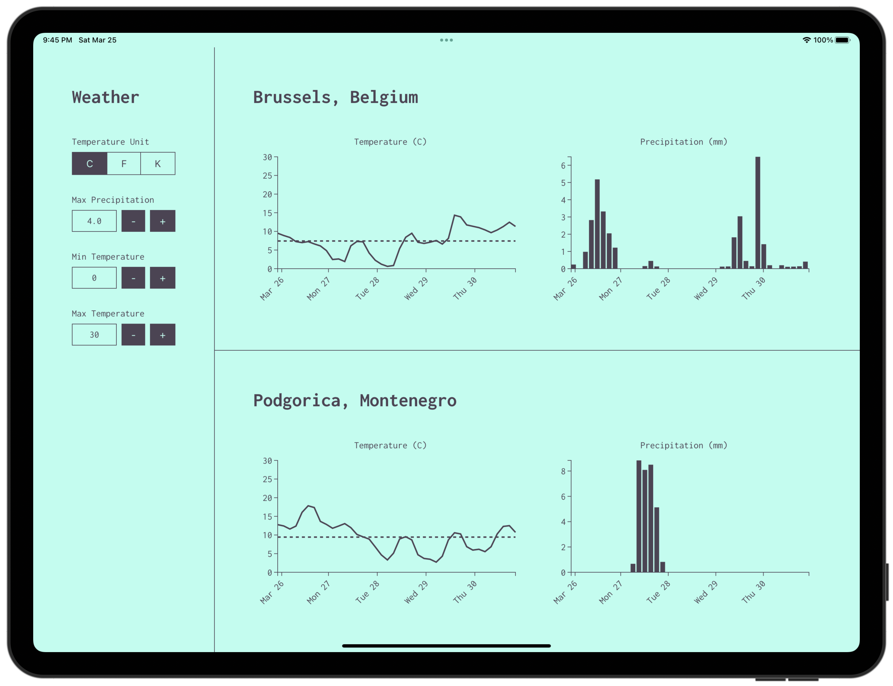

# Weather

Sorts upcoming weather conditions in European capitals and enables users to filter the results.



## Development

```
npm run lint
npm run format
```

### Data

Fetches the weather.

```
cd packages/data
echo "OWM_API_KEY=..." > .env
npm run build
```

### Client

Starts the client in devlepment mode.

```
cd packages/client
npm run dev
```
